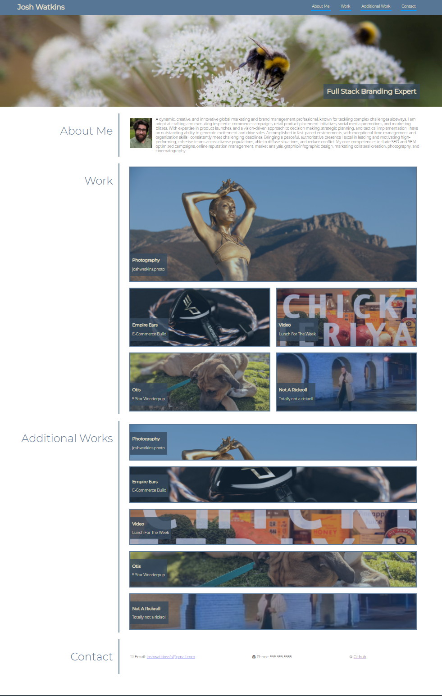

# Homework_02_Professional_Portfolio
Homework Assignment 02 - Due EOD 9/15/2021

This application is a portfolio template created to showcase my eventual finished projects. In the mean time, it has been populated with links to some of my previous work and then some fun stuff. 

I followed the brief and created a page that is navigable using the links in the header, contains a bio with an image and that showcases a series of work projects, one more significantly than the others. To showcase which the user was looking at an overlay is rendered over the image until the user hovers over it. To experiment further with this concept I created an additional section where hovering over an image highlights it not only through the overlay but in the size of the card as well. Thought that was pretty cool.

You can find the project at this link: https://joshuakwatkins.github.io/Homework_02_Professional_Portfolio/

